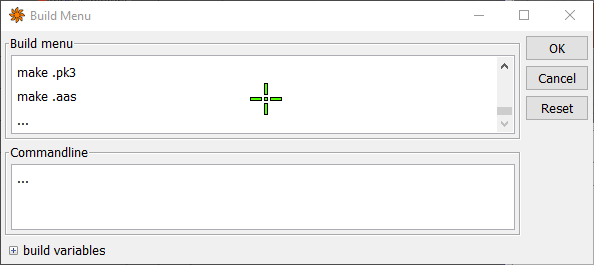
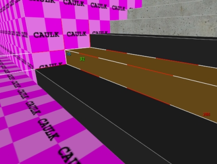
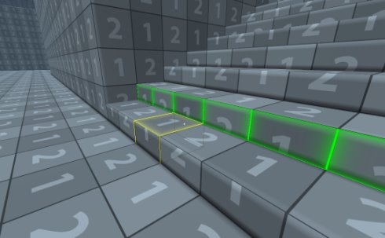
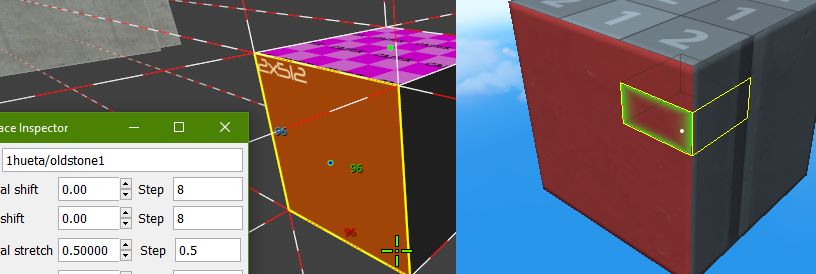
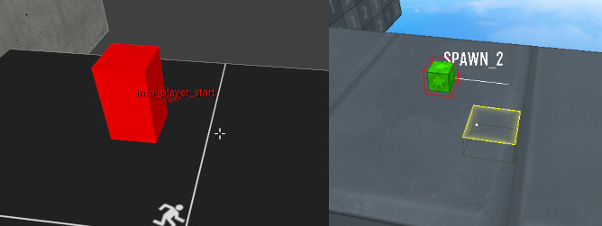
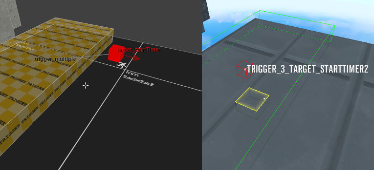
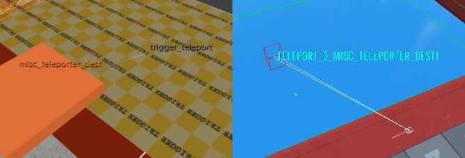
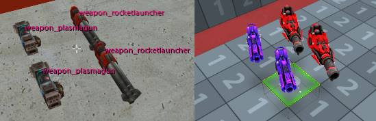
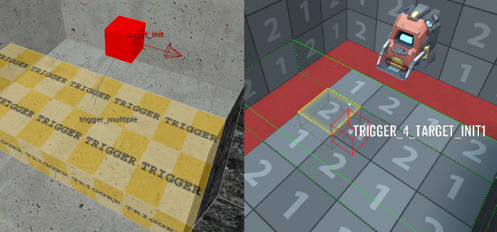

## Setup

1. Download the map converter tool [here](/downloads/mapper_v2.7z)

2. If you do not already have radiant, you can download it here: [NetRadiantCustom](https://github.com/Garux/netradiant-custom/releases)

3. Place `mapper.exe`, `dbt_template_v26.rbe`, and `q3_dbt_materials.txt` in Radiant's main directory (where `radiant.exe` lives)

4. Open up Radiant and go to `Build->Customize...`

5. Scroll to the end of the build menu and click on the `...` to create a new item

6. Set the commandline for the new build menu item to the following:

   ```b
   mapper.exe q3-dbt "[MapFile]" "%APPDATA%\\Diabotical\\Maps\\[MapName].rbe"
   ```

   

You can now go ahead and start mapping in radiant. If everything worked correctly the new build option should create a Diabotical map with the same name as your Quake 3 map. If you have Diabotical open you can then use `/edit my_map_name` to load it.

## Restrictions

- Brushes have to be aligned on the 32x32 unit grid to be mapped over properly.  (Radiant default bind: `6` - sets grid size to 32u)
- Each 32 units in radiant maps to 1 block in DBT. 
- If you want to make half blocks or 'slabs' in DBT (used for stairs, etc.), you can work **vertically** at the 16 unit grid level which translates to a single slab in DBT. (default bind: `5` sets grid size to 16u)

Here you can see a 16 unit tall brush get converted to a single slab in DBT:




## Supported Features

### Material Translation

You can convert quake 3 materials to DBT materials by adding entries in the `q3_dbt_materials.txt` file.

```
1hueta/oldstone1=sport_concrete01_red
1hueta/oldstone7=concrete_wall_01
```



### Player Spawns

Create spawns using an `info_player_start` entity.

Supported keys: `angle`



### Race Start & Race End

Connect a `trigger_multiple` brush to a `target_startTimer` or `target_stopTimer` entity.



### Kill Trigger

Connect a `trigger_multiple` brush to a `target_kill` entity.

### Teleporter

Connect a `trigger_teleport` brush to a `misc_teleporter_dest` entity.

The `trigger_teleport` entity supports the following keys: `speed_mode`, `speed`, `angle_mode`, `view_angle_mode`, `reset`

The `misc_teleporter_dest` entity supports the following keys: `angle`



### Weapons

The following weapon entities are converted: `weapon_rocketlauncher`, `weapon_plasmagun`

Supported keys: `time` - sets pickup respawn time in seconds



### Remove Weapons Trigger

Connect a `trigger_multiple` brush to a `target_init` entity.



